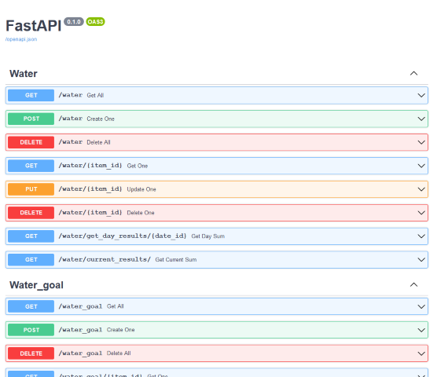

# Smart Life Dashboard Pt. 1: Data API

I am always looking for a way to be more organized. This usually takes the shape of downloading aevery organizational app or buying multiple agendas. However I have a spare RaspberryPI 3 with a nice touchscreen so I figured creating a dashboard to make sure I stay organized and perform all my tasks would be a fun project to undertake.

## Project Setup

In terms of what I want to accomplish right of the bat, there are a few things:
* Keep track of water intake
* Keep track of excercize
* Keep track of vitamins consumed
* Flexible task creation
* Weight tracking

For a bunch of these the good thing is we already done a significant amount of work since the information comes from Fitbit and Strava.

In order to work with this we will need to create the following components:

* Postgres DB
* Celery Worker (mostly for routine tasks)
* FastAPI (to handle most input)
* Vue Frontend (both data entry and dashboard)
* Scheduler

## Backend Structure Design
I enjoy a modified strucutre design where each specific module is separated. The strucutre then will look like this:
```
- main
    - server
        - db
            - __init__.py
            - base_class.py
            - base.py
            - session.py
        - water
            - __init__.py
            - crud.py
            - models.py
            - routers.py
            - schemas.py
        - vitamins
            - __init__.py
            - crud.py
            - models.py
            - routers.py
            - schemas.py
        - tasks
            - __init__.py
            - crud.py
            - models.py
            - routers.py
            - schemas.py
        - excercize
            - __init__.py
            - crud.py
            - models.py
            - routers.py
            - schemas.py
        __init__.py
        dependencies.py
        main.py
        requirements.txt
```
Each individual function is contained with their own sqlchemy modules, crud, fastapi router. That way implementing new functionality will be easier down the road.

For each module we have the following:
* `models.py`: sqlalchemy models. We handle migrations with alembic
* `schemas.py`: contains our pydantic schemas to handle our parsing and a small amount of validation
* `routers.py`: contains our FastAPI router, just like with flask we define the different route actions here.
* `crud.py`: contains our db operations using sqlalchemy models. We only write the non-standard ones here.
* `__init__.py`: imports all models and includes our routers.


> Quick note: we define a `db` module. One will handel our session. But more importantly per the documentation of [FastAPI](https://fastapi.tiangolo.com/). We need to declare a base at `base_class.py` and then import all our models from all modules into `base.py`.
>```python
>#base.py
>from server.db.base_class import Base
>from server.water.models import Water, Water_Goal
>...
>```
>This is necessary for alembic to recognize our classes.

### models.py
Implementing our db classes is fairly straightforward sqlalchemy. We make sure to use a relative import to pull the `base_class` from `db`.
```python
# water/models.py

# Define our base class and our goal class
from ..db.base_class import Base
from sqlalchemy import Boolean, Column, ForeignKey, Date, Integer, String
from sqlalchemy.orm import relationship

class Water(Base):
    __tablename__ = "water"
    id = Column(Integer, primary_key=True, index=True)
    date = Column(Date)
    size = Column(Integer)


class Water_Goal(Base):
    __tablename__ = "water_goals"
    id = Column(Integer, primary_key=True, index=True)
    date = Column(Date)
    size = Column(Integer)


```

You want to follow the instructions on FastAPI's documentation. An in order to make calls to our db we will use the `get_db()` method to wrap our calls with commit, rollaback and close.
```python
 # dependencies.py
from .db.session import SessionLocal

def get_db():
    db = SessionLocal()
    try:
        yield db
        db.commit()
    except:
        db.rollback()
        raise
    finally:
        db.close()
```

### schemas.py
Dealing with parsing inputs and responses is very straightforward using pydantic. This will also perform type validation on it.

For both goals and records we define a base, a creation schema and a record schema. We also set the record schema to allow orm_mode to play nice with sqlalchemy.

```python
# water/schemas.py
from typing import List, Optional
from uuid import UUID
from datetime import date

from pydantic import BaseModel

#---WATER---#
class WaterBase(BaseModel):
    date: date
    size: int


class Water(WaterBase):
    id: int

    class Config:
        orm_mode = True


class WaterCreate(WaterBase):
    pass

#---WATER GOAL---#
class WaterGoal(WaterBase):
    id: int

    class Config:
        orm_mode = True


class WaterGoalCreate(WaterBase):
    pass
```

### routers.py
Half of the appeal of using FastAPI or Flask is the amount of different modules that save you time. Since I dont want to define the same basic crud setup every single time we will use [fastapi_crudrouter](https://github.com/awtkns/fastapi-crudrouter), to take of that part and add or overwrite the routes as we need.

To add use crudrouter its pretty straight forward

```python
from fastapi.encoders import jsonable_encoder
from . import schemas, models
from ..dependencies import get_db
from sqlalchemy.orm import Session
from sqlalchemy import func
from . import schemas, crud
from datetime import date

from fastapi import Depends

from fastapi_crudrouter import SQLAlchemyCRUDRouter

water_router=SQLAlchemyCRUDRouter(
    schema=schemas.Water,
    create_schema=schemas.WaterCreate,
    db_model=models.Water,
    db=get_db,
    prefix="water"
)
```
We pass all the necessary schemas, models and db sessions and crudrouter takes care of the rest.
For more complex routes we can just add them directly to the router. For example if we wanted to get the total water consumed in one day we could do the following.

```python
@water_router.get("/get_day_results/{date_id}")
def get_day_sum(date_id: date, db: Session =Depends(get_db)):
    water=db.query(models.Water).filter(models.Water.date==date_id)
    ws=water.with_entities(func.sum(models.Water.size)).scalar()
    if ws is None:
        return jsonable_encoder({'sum': 0})
    else:
        return jsonable_encoder({'sum': ws})
```

### crud.py
Finally we can define additional db methods here, but again crudrouter takes care of most of this for us, so in general these will be empty.

We can define method to query and get us our most recent goal as follows:

```python
from sqlalchemy.orm import Session

from . import models, schemas
from ..dependencies import get_db

def get_current_water_goal(db: Session):
    return db.query(models.Water_Goal).order_by(models.Water_Goal.date.desc()).first()
```

## Putting it all together

Now that we have defined all the modules and their functionality it is time to assemble our api. Since we defined all our routes in each of the modules assembling it all is extremly easy.

We start a FastAPI instance. Handle CORS (since we will use a vue frontend) and then use the create_module methods we defined in each `__init__` file.

This will look like this.
```python
# main.py
from fastapi import Depends, FastAPI
from fastapi.middleware.cors import CORSMiddleware
app = FastAPI()

origins = [
    "http://localhost",
    "http://localhost:8080",
    "http://localhost:8081",
    "http://192.168.1.181:8081"
]

app.add_middleware(
    CORSMiddleware,
    allow_origins=origins,
    allow_credentials=True,
    allow_methods=["*"],
    allow_headers=["*"],
)

from .water import create_module as water_create
from .vitamin import create_module as vitamin_create
from .task import create_module as task_create
from .strava import create_module as strava_create

water_create(app)
vitamin_create(app)
task_create(app)
strava_create(app)
```

Finally we can just fire up FastAPI on uvicorn with the command
`uvicorn server.main:app --reload`.

One of the nice features of FastAPI is it automatically generates documentation for it and allows you to test each of the routes from the interactive page.

If we go to http://127.0.0.1:8000/docs#/ we will see that page.



Now we have a fully functionig API and can get to work on the front end.


